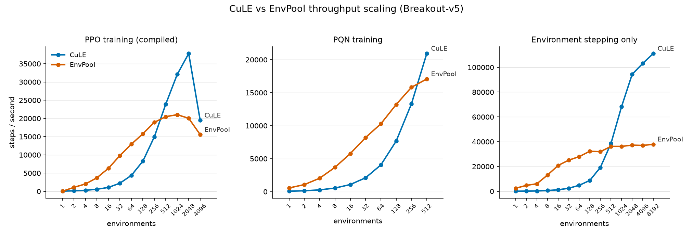

# CuLE — GPU-Accelerated Atari Environments for Reinforcement Learning

CuLE (CUDA Learning Environment) is a CUDA port of the Atari Learning
Environment (ALE) created by NVIDIA. It emulates thousands of Atari 2600
games *directly on the GPU* and renders frames there too, so reinforcement
learning agents can collect experience massively in parallel without the
CPU-to-GPU bandwidth bottleneck that limits conventional emulators.

This repository is a modernized, maintained fork of
[NVlabs/cule](https://github.com/NVlabs/cule) (2019). On top of the original
project it provides:

- **A modern software stack** — builds with CUDA 12.x, runs against current
  PyTorch releases on Python 3.12, and uses
  [Gymnasium](https://gymnasium.farama.org) and
  [ale-py](https://github.com/Farama-Foundation/Arcade-Learning-Environment)
  (ROMs are bundled with ale-py; no separate ROM installation).
- **Upstream bug fixes** — 14 games that crashed at construction now work;
  61 games pass automated health checks *and* per-game behavioral
  verification against the reference ale-py emulator on both the CPU and GPU
  backends. See [CHANGES.md](CHANGES.md) for the complete list.
- **An optimized GPU renderer** — the frame-rendering kernel is now
  warp-cooperative, raising environment throughput by 34–48% over upstream
  while remaining bit-exact with the original emulation.
- **Modern trainers** — [CleanRL](https://github.com/vwxyzjn/cleanrl)-style
  single-file PPO, DQN, C51, Rainbow, PQN, and discrete-SAC trainers with a
  CuLE backend, including `torch.compile`/CUDA-graph variants
  ([cleanrl/](cleanrl/)), alongside the original A2C, V-trace, PPO, and DQN
  examples ([examples/](examples/)).
- **Reproducible benchmarks** — the scripts used for every number below live
  in [benchmarks/](benchmarks/).

# Why CuLE?

All measurements below are from a single machine: RTX 4090, i5-13600K,
PyTorch 2.13 (cu130), CUDA 12.9. Scripts to reproduce them are in
[benchmarks/](benchmarks/).

## Raw environment throughput

Breakout, grayscale 84×84, frameskip 4, random actions, no learner. One
env-step corresponds to four emulated Atari frames:

| Parallel envs | Env-steps/s | Atari frames/s |
|---:|---:|---:|
| 256 | 21,177 | ~85k |
| 1,024 | 74,937 | ~300k |
| 4,096 | 113,654 | ~455k |

## End-to-end training throughput vs EnvPool

Full compiled-PPO training loop on Breakout (environment stepping, inference,
advantage computation, backpropagation, and optimizer updates), CuLE vs
[EnvPool](https://github.com/sail-sg/envpool) 1.2.5. Mean steps/second over
3–6 repeats per point:

| Setting | CuLE SPS | EnvPool SPS |
|---|---:|---:|
| 256 envs (equal count) | 14,927 | 18,927 |
| Each backend's best count | **37,811** (at 2,048 envs) | 21,031 (at 1,024 envs) |

EnvPool, which steps environments on the CPU, is slightly ahead at small
environment counts. CuLE keeps scaling: at its best batch size it delivers
**about 1.8× EnvPool's peak training throughput** on this machine, and the
gap widens with the environment count. The native V-trace example goes
further still, reaching ~60k SPS at 12,288 environments.

## How far does it scale?

The same comparison swept across environment counts, for the compiled-PPO and
PQN training loops and for environment stepping with no learner:



The pattern is the same in every panel: EnvPool leads while it has spare CPU
cores, then saturates and plateaus, while CuLE keeps climbing on the GPU. The
crossover is around **512 environments**. Beyond it, CuLE's lead grows with the
batch — PPO training peaks near **1.8×** EnvPool, and pure environment stepping
reaches **~2.9×** (CuLE ~111k SPS at 8,192 envs versus EnvPool's ~38k plateau).
CuLE also holds a flat ~1 GB host-RAM footprint across the whole range, while
EnvPool's grows to ~10 GB at 8,192 envs.

**Rule of thumb:** if you can batch ≥512 environments, CuLE is the faster
backend end to end; below that, a CPU vectorizer like EnvPool wins on a
strong CPU.

# Installation

Tested environment:

|**Operating System** | **Compiler** | **CUDA** | **Python / PyTorch** |
|-----------------|----------|------|------------------|
| Ubuntu 22.04 (WSL2) | GCC 11.4 | 12.9 | 3.12 / torch 2.13 (cu130) |

CuLE runs on Maxwell- through Ada/Hopper-architecture NVIDIA GPUs (tested on
an RTX 4090, sm_89). The build targets the compute capability of the GPUs
detected at compile time.

Clone the repository (with submodules) and pin the `pybind11` submodule to a
modern release:

```
$ git clone --recursive https://github.com/MehrdadMoghimi/cule
$ cd cule
$ git -C third_party/pybind11 fetch --tags && git -C third_party/pybind11 checkout v2.13.6
```

Create and activate an environment — either **conda**:

```
$ conda create -n cule python=3.12
$ conda activate cule
```

or a **venv**:

```
$ python3.12 -m venv .venv
$ source .venv/bin/activate
```

Install the Python dependencies and build the extension against your local
CUDA toolkit:

```
$ pip install -r requirements.txt
$ CUDA_HOME=/usr/local/cuda-12.9 pip install --no-build-isolation -e .
```

Notes:
- `CUDA_HOME` should point to a CUDA 12.x toolkit whose `nvcc` supports your GPU.
- `--no-build-isolation` is required because `setup.py` queries the local torch
  installation for the GPU architectures to compile for.
- The extension does not link against libtorch, so the toolkit used to build it
  does not need to match the CUDA version of the PyTorch wheels.
- The pinned `pybind11` submodule commit predates Python 3.11 — check out a
  modern release tag as shown above (setup.py errors out early otherwise).
- The unmaintained `agency` submodule needs small fixes for GCC >= 9;
  setup.py applies [third_party/patches/agency-modern-toolchain.patch](third_party/patches/agency-modern-toolchain.patch)
  automatically when it is missing. Because upstream
  [agency](https://github.com/agency-library/agency) is no longer maintained,
  `.gitmodules` points at a personal fork that carries the same fix, so a fresh
  clone builds without the patch step. Both are NVIDIA's 3-clause BSD code; the
  fork changes only what the patch changes. Repoint the submodule at upstream
  if you would rather apply the patch yourself.
- A Dockerfile with the full build is available at [envs/Dockerfile](envs/Dockerfile)
  (see the original README below for docker usage).

# Using CuLE

## As a library

The `torchcule` package exposes batched Atari environments with a
Gym-like API that returns PyTorch tensors on the selected device:

```python
from torchcule.atari import Env

env = Env("BreakoutNoFrameskip-v4", num_envs=1024, device="cuda",
          color_mode="gray", rescale=True, frameskip=4, episodic_life=True)
obs = env.reset()                      # (1024, 84, 84, 1) uint8, on the GPU
obs, reward, done, info = env.step(actions)   # actions: (1024,) int tensor
```

Legacy Gym-style names (`PongNoFrameskip-v4`) and Gymnasium names
(`ALE/Pong-v5`) are both accepted.

## CleanRL-style trainers

The [cleanrl/](cleanrl/) directory contains single-file trainers for PPO
(plus a recurrent variant), DQN, C51, Rainbow, PQN, and discrete SAC. All of
them accept `--env-backend cule`, and PPO/DQN/C51/Rainbow/PQN also have
`torch.compile` + CUDA-graph variants:

```
python cleanrl/ppo_atari_envpool_torchcompile.py \
  --env-backend cule --env-id BreakoutNoFrameskip-v4 \
  --num-envs 1024 --num-steps 8 --compile --cudagraphs

python cleanrl/dqn_atari.py \
  --env-backend cule --env-id PongNoFrameskip-v4 \
  --num-envs 256 --batch-size 512 --replay-ratio 1
```

See [cleanrl/README_CULE.md](cleanrl/README_CULE.md) for the full list of
scripts, flags, and per-algorithm throughput numbers.

## Native examples

The original CuLE example trainers live in [examples/](examples/). They share
the same core flags:

- `--env-name <name>` — the Atari game to train on.
- `--use-cuda-env` — emulate the Atari environments on the GPU. Omit it to use
  the CuLE CPU backend, or pass `--use-openai` to generate training data with
  the reference gymnasium/ale-py emulator.
- `--num-ales N` — number of parallel environments; use hundreds to thousands
  with `--use-cuda-env`.
- `--evaluation-interval N` — frames between evaluations. Each evaluation plays
  10 full episodes on the CPU, so a small interval makes evaluation — not
  training — dominate wall-clock time.

**A2C + V-trace** (best throughput; from `examples/vtrace`):

```
python vtrace_main.py --env-name PongNoFrameskip-v4 --normalize --use-cuda-env --num-ales 1200 --num-steps 20 --num-steps-per-update 1 --num-minibatches 20 --t-max 8000000 --evaluation-interval 2000000
```

**A2C** (from `examples/a2c`):

```
python a2c_main.py --env-name BreakoutNoFrameskip-v4 --use-cuda-env --num-ales 256 --num-steps 5 --t-max 8000000 --evaluation-interval 2000000
```

**PPO** (from `examples/ppo`):

```
python ppo_main.py --env-name BreakoutNoFrameskip-v4 --use-cuda-env --num-ales 256 --num-steps 20 --t-max 8000000 --evaluation-interval 2000000
```

**DQN** (from `examples/dqn`):

```
python dqn_main.py --env-name SeaquestNoFrameskip-v4 --use-cuda-env --num-ales 32 --t-max 2000000 --memory-capacity 100000
```

**Visualize a trained or random policy** (from `examples/visualize`):

```
python animate.py --env-name BreakoutNoFrameskip-v4 --use-cuda --num-envs 16
```

## Supported games

Any of the following can be passed to `--env-name`, either as
`<CamelCaseName>NoFrameskip-v4` / `ALE/<CamelCaseName>-v5` or as the plain
rom id shown here. These 61 games pass automated health checks *and* a
per-game behavioral verification against the reference ale-py emulator
(frames render and change, rewards flow under random play at rates consistent
with ale-py, and agent actions demonstrably influence the game) on both the
CPU and GPU backends:

```
adventure, air_raid, alien, amidar, assault, asterix, asteroids, atlantis,
bank_heist, battle_zone, beam_rider, berzerk, bowling, boxing, breakout,
carnival, centipede, chopper_command, crazy_climber, defender, demon_attack,
enduro, fishing_derby, freeway, frostbite, gopher, gravitar, hero,
ice_hockey, jamesbond, journey_escape, kaboom, kangaroo, krull,
kung_fu_master, montezuma_revenge, ms_pacman, name_this_game, phoenix,
pitfall, pong, pooyan, private_eye, qbert, riverraid, road_runner, robotank,
seaquest, skiing, solaris, space_invaders, star_gunner, tennis, time_pilot,
tutankham, up_n_down, venture, video_pinball, wizard_of_wor, yars_revenge,
zaxxon
```

Notes on some supported games:

- `adventure`, `enduro`, `freeway`, `montezuma_revenge`, `venture`, `zaxxon`
  give few or no rewards under short *random* play — the reference ale-py
  emulator behaves the same way; they reward normally once a policy starts
  acting sensibly.
- `air_raid` is a PAL cartridge: CuLE renders it with its PAL palette, so
  colors differ from ale-py's rendering. Gameplay, rewards, and episodes
  are equivalent.

Two games remain **broken** (see [CHANGES.md](CHANGES.md)); they construct
and run but are not usable for training:

```
double_dunk       (agent input is ignored; the ROM's demo plays itself)
elevator_action   (no rewards on the CPU backend, implausible ones on GPU)
```

Other ale-py roms load as well, but without game-specific reward/lives
decoding they are not useful for training.

## Practical performance tips

- **Batch big.** CuLE's advantage comes from parallelism: throughput keeps
  scaling into the thousands of environments, while CPU vectorizers plateau
  early. Below ~512 environments, prefer a CPU backend.
- **The environment loop, not the model, is the bottleneck** for the small
  Atari convnets — larger `--num-ales`/`--num-envs`, a larger evaluation
  interval, and reusing rollouts for more updates help more than model-side
  tricks.
- **Maximum SPS is not the objective.** In a fixed-budget Breakout
  comparison, the highest-throughput configuration (V-trace at ~24k SPS)
  learned the least, while compiled PPO and DQN produced the best policies.
  Pick configurations by reward versus wall-clock, not by SPS alone.
- The [benchmarks/](benchmarks/) folder contains resumable throughput sweeps
  (`benchmark_step_throughput.py`, `benchmark_cule_envpool.py`,
  `benchmark_implementations.py`) and fixed-budget learning comparisons
  (`benchmark_learning.py`, `run_ppo_breakout_paired_10m.py`) to re-measure
  all of the above on your own hardware.

# Testing

The repository ships a pytest suite covering ROM resolution, the CPU and GPU
environment backends (shapes, rewards, determinism, several games across all
supported cartridge formats), the Gymnasium wrapper stack, and end-to-end
micro-training runs for every algorithm:

```
pip install pytest
pytest              # fast checks (~1 minute; GPU tests auto-skip without CUDA)
pytest -m slow      # end-to-end training micro-runs for a2c/vtrace/ppo/dqn
```

# Licensing and credit

This repository is a fork of [NVlabs/cule](https://github.com/NVlabs/cule) and
is distributed under the same 3-clause BSD license.

- Original CuLE — Copyright (c) 2017-2019, NVIDIA CORPORATION. The upstream
  notice is preserved verbatim in [LICENSE.TXT](LICENSE.TXT).
- This fork's additions (the trainers, benchmarks, tests, and the modernization
  and GPU-kernel work) — Copyright (c) 2026, Mehrdad Moghimi, under the same
  BSD terms.

The trainers in [cleanrl/](cleanrl/) bundle code from three MIT-licensed
projects — [CleanRL](https://github.com/vwxyzjn/cleanrl),
[LeanRL](https://github.com/meta-pytorch/LeanRL), and
[stable-baselines3](https://github.com/DLR-RM/stable-baselines3) — and the
algorithms this fork ported itself follow the authors' official releases. Each
script names its own provenance in its header;
[cleanrl/LICENSE.md](cleanrl/LICENSE.md) has the full license texts and a
per-file table.

No Atari ROMs are distributed here; `ale-py` supplies them at runtime under its
own terms. See [NOTICE.md](NOTICE.md) for the complete picture.

---

# Original README

*The remainder of this file is the original README from
[NVlabs/cule](https://github.com/NVlabs/cule) (July 2019), lightly updated
where the original instructions no longer work on modern stacks.*


# CuLE 0.1.0

_CuLE 0.1.0 - July 2019_

CuLE is a CUDA port of the Atari Learning Environment (ALE) and is
designed to accelerate the development and evaluation of deep
reinforcement algorithms using Atari games. Our CUDA Learning
Environment (CuLE) overcomes many limitations of existing CPU- based
Atari emulators and scales naturally to multi-GPU systems.  It leverages
the parallelization capability of GPUs to run thousands of Atari games
simultaneously; by rendering frames directly on the GPU, CuLE avoids the
bottleneck arising from the limited CPU-GPU communication bandwidth.

# Project Structure

```
cule/
  cule/
  env/
  examples/
  media/
  third_party/
  torchcule/
```

Several example programs are also distributed with the CuLE library. They are
contained in the following directories.

```
examples/
  a2c/
  dqn/
  ppo/
  vtrace/
  utils/
  visualize/
```

# Docker 

The recommended (and easiest) way of using CuLE is through Docker.
We assume nvidia-docker is already installed in your system.
To build the CuLE image you can use the following docker file - create a file named "Dockerfile" in your preferred folder and copy the following text into it:

```
FROM nvidia/cuda:12.9.1-devel-ubuntu24.04

ARG DEBIAN_FRONTEND=noninteractive

RUN apt-get -y update && apt-get install -y --no-install-recommends \
        build-essential git python3 python3-dev python3-pip python3-venv \
    && rm -rf /var/lib/apt/lists/*

RUN python3 -m venv /opt/venv
ENV PATH="/opt/venv/bin:$PATH"

RUN pip install --upgrade pip setuptools wheel && \
    pip install torch gymnasium ale-py cloudpickle opencv-python-headless \
                psutil pytz tensorboard tqdm

RUN git clone -b master --recursive https://github.com/MehrdadMoghimi/cule && \
    cd cule && \
    git -C third_party/pybind11 fetch --tags && \
    git -C third_party/pybind11 checkout v2.13.6 && \
    pip install --no-build-isolation .
```

(The same file is available at [envs/Dockerfile](envs/Dockerfile).)

Once the docker file has been created and saved, you can build the docker image by typing (in the same folder of the docker file):

```
sudo nvidia-docker build -t cule_release .
```

You can then run the following command to access a CuLE-ready terminal:

```
sudo nvidia-docker run -it -t cule_release bash
```

You have now access to CuLE and can run different algorithms, including DQN, PPO, A2C, and A2C+V-trace.
A2C+V-trace uses the best batching strategy to leverage the high troughput generated by CuLE.
To replicate the same results reported in our paper (e.g. reaching an average score of 18 for Pong in less than 3 minutes using a single GPU) you can run the following commands:

```
cd cule\examples\vtrace
python vtrace_main.py --env-name PongNoFrameskip-v4 --normalize --use-cuda-env --num-ales 1200 --num-steps 20 --num-steps-per-update 1 --num-minibatches 20 --t-max 8000000 --evaluation-interval 200000
```

The parameters passed to vtrace_main.py specify: the name of the environment (--env-name PongNoFrameskip-v4, same naming convention adopted in OpenAIGym, all our environments are -v4); normalization of the input images (--normalize, this is the normalization procedure normaly adopted in RL for Atari games; notice that, with no normalization, convergence takes way more time); the use of GPU to simulate the environments (--use-cuda-env; if you want to use OpenAI instead, use --use-openai; if you want to use the CuLE CPU backend to generate data, do not specify any of these two); the total number of environments simulated (--num-ales 1200; for an effective use of CuLE, use a large number of environments); the number of steps in the buffer used to compute the discounted rewards (--num-steps 20; if the number of steps is too large, you may saturate the memory); the number of steps after which a DNN update is computed (--num-steps-per-update 1, meaning that an update is computed after each CuLE steps trhough all the environments); the number of minibatches in the total population of environments (in this case --num-minibatches 20 guarantees that each minibatch, composed by 1200 / 20 = 60 environments, advances by 20 steps before using its data to update the DNN; since there are exactly 20 minibatches and one update is computed at each step, it means that for any step simulated by CuLE one batch is providing training data the the GPU for the update; each experience is used only once for training in this case - with other configurations the same experience may be used multiple times, for a more sample efficient data generation strategy; where data between different batches are however correlated); the total number of steps to be performed in training (--t-max 8000000); and the total number of steps to evaluate the DNN on the testing environments (--evaluation-interval 200000). 
The CuLE CPU backend is used by default for testing. If you want to use OpenAIGym instead, use --use-openai-test-env. 

# Citing

```
@inproceedings{NEURIPS2020_e4d78a6b,
 author = {Dalton, Steven and frosio, iuri},
 booktitle = {Advances in Neural Information Processing Systems},
 editor = {H. Larochelle and M. Ranzato and R. Hadsell and M. F. Balcan and H. Lin},
 pages = {19773--19782},
 publisher = {Curran Associates, Inc.},
 title = {Accelerating Reinforcement Learning through GPU Atari Emulation},
 url = {https://proceedings.neurips.cc/paper/2020/file/e4d78a6b4d93e1d79241f7b282fa3413-Paper.pdf},
 volume = {33},
 year = {2020}
}

@misc{dalton2019gpuaccelerated,
   title={GPU-Accelerated Atari Emulation for Reinforcement Learning},
   author={Steven Dalton and Iuri Frosio and Michael Garland},
   year={2019},
   eprint={1907.08467},
   archivePrefix={arXiv},
   primaryClass={cs.LG}
}
```

# About

CuLE is released by NVIDIA Corporation as Open Source software under the
3-clause "New" BSD license.

# Copyright

Copyright (c) 2017-2019, NVIDIA CORPORATION.  All rights reserved.

```
  Redistribution and use in source and binary forms, with or without modification, are permitted
  provided that the following conditions are met:
      * Redistributions of source code must retain the above copyright notice, this list of
        conditions and the following disclaimer.
      * Redistributions in binary form must reproduce the above copyright notice, this list of
        conditions and the following disclaimer in the documentation and/or other materials
        provided with the distribution.
      * Neither the name of the NVIDIA CORPORATION nor the names of its contributors may be used
        to endorse or promote products derived from this software without specific prior written
        permission.

  THIS SOFTWARE IS PROVIDED BY THE COPYRIGHT HOLDERS AND CONTRIBUTORS "AS IS" AND ANY EXPRESS OR
  IMPLIED WARRANTIES, INCLUDING, BUT NOT LIMITED TO, THE IMPLIED WARRANTIES OF MERCHANTABILITY AND
  FITNESS FOR A PARTICULAR PURPOSE ARE DISCLAIMED. IN NO EVENT SHALL NVIDIA CORPORATION BE LIABLE
  FOR ANY DIRECT, INDIRECT, INCIDENTAL, SPECIAL, EXEMPLARY, OR CONSEQUENTIAL DAMAGES (INCLUDING,
  BUT NOT LIMITED TO, PROCUREMENT OF SUBSTITUTE GOODS OR SERVICES; LOSS OF USE, DATA, OR PROFITS;
  OR BUSINESS INTERRUPTION) HOWEVER CAUSED AND ON ANY THEORY OF LIABILITY, WHETHER IN CONTRACT,
  STRICT LIABILITY, OR TOR (INCLUDING NEGLIGENCE OR OTHERWISE) ARISING IN ANY WAY OUT OF THE USE
  OF THIS SOFTWARE, EVEN IF ADVISED OF THE POSSIBILITY OF SUCH DAMAGE.
```
