# Algorithm lineage

Every trainer in `cleanrl/` is a single file, and almost every one of them is a
small, readable diff off another one. This document records that structure: for
each algorithm, which file it descends from, what it *inherits* unchanged, and
what it *changes*. Reading a child alongside its parent is the fastest way to
see what a paper actually contributes.

Each algorithm has an eager file and a `*_torchcompile.py` twin. The twin is
never a different algorithm — it is the same maths reorganised into fixed-shape
regions that `torch.compile` and `CudaGraphModule` can capture, usually with
TorchRL GPU replay in place of the NumPy replay. Twins are therefore omitted
from the graph below; assume each node has one.

## The tree

```mermaid
graph TD
    DQN["<b>dqn_atari</b><br/>replay + target net<br/>eps-greedy Q-learning"]

    DQN --> C51["<b>c51_atari</b><br/>categorical value dist"]
    DQN --> QRDQN["<b>qrdqn_atari</b><br/>quantile regression"]
    DQN --> SAC["<b>sac_atari</b><br/>discrete soft AC"]
    DQN --> QDAGGER["<b>qdagger</b><br/>distillation + RL"]
    DQN --> STREAMQ["<b>stream_q_atari</b> ★<br/>removes replay + target net<br/>ObGD eligibility traces"]

    C51 --> RAINBOW["<b>rainbow_atari</b><br/>noisy + dueling + PER<br/>+ n-step + double"]
    QRDQN --> IQN["<b>iqn_atari</b><br/>implicit quantiles"]
    IQN --> FQF["<b>fqf_atari</b><br/>learned tau fractions"]
    IQN --> MIQN["<b>miqn_atari</b><br/>Munchausen bonus<br/>+ soft bootstrap"]
    MIQN --> BTR["<b>btr_atari</b> ★<br/>Impala-2x + spectral norm<br/>+ 6x6 maxpool + PER"]

    RAINBOW --> DER["<b>der_atari</b><br/>Atari-100K retune"]
    DER --> DRQ["<b>drq_atari</b><br/>shift augmentation"]
    DRQ --> SPR["<b>spr_atari</b><br/>latent dynamics<br/>self-prediction"]
    SPR --> BBF["<b>bbf_atari</b><br/>periodic resets<br/>+ n/gamma anneals"]

    PPO["<b>ppo_atari</b><br/>clipped policy gradient"]
    PPO --> PPOLSTM["<b>ppo_atari_lstm</b><br/>recurrent policy"]
    PPO --> PQN["<b>pqn_atari_envpool</b><br/>replay-free Q(lambda)<br/>LayerNorm, no target net"]
    PQN --> HADAMAX["<b>hadamax_pqn_atari_envpool</b> ★<br/>Hadamard-product encoder"]

    RAINBOW --> R2D2["<b>r2d2_atari</b> ★<br/>sequence replay + stored state<br/>burn-in, value rescaling"]
    PPOLSTM -.recurrent core.-> R2D2
    STREAMQ --> STREAMAC["<b>stream_ac_atari</b> ★<br/>actor-critic objective<br/>two ObGDs, two kappas"]
    PPO -.actor-critic.-> STREAMAC

    SPR --> MRQ["<b>mrq_atari</b> ★<br/>model-based encoder<br/>+ frozen-zsa TD3"]
    PPO --> DISCO["<b>disco_atari</b> ★<br/>discovered update rule<br/>frozen meta-LSTM targets"]

    PPO --> A2C["<b>a2c_atari</b> ●<br/>PPO minus clip/epochs/GAE<br/>TF-semantics RMSProp"]
    A2C --> A2CSIL["<b>a2c_sil_atari</b> ●<br/>self-imitation replay<br/>(R-V)+ as weight and priority"]
    PPO --> IMPALA["<b>impala_atari</b> ●<br/>V-trace off-policy correction<br/>truncated IS, sum-reduced losses"]
    PPO --> PPG["<b>ppg_atari</b> ●<br/>dual networks + aux phase<br/>value distilled into policy"]
    PPO --> PPORND["<b>ppo_rnd_atari</b> ●<br/>random-network novelty bonus<br/>two heads, two discounts"]
    PPOLSTM --> PPOTRXL["<b>ppo_trxl_atari</b> ●<br/>Transformer-XL episodic memory<br/>sliding attention window"]
    PPO --> DPO["<b>dpo_atari</b> ●<br/>discovered drift function<br/>replaces the clip"]
    PPO --> OUTERPPO["<b>outer_ppo_atari</b> ●<br/>outer LR + Nesterov<br/>on the net update vector"]
    PPO --> GPG["<b>gpg_atari</b> ●<br/>critic-free, group baseline<br/>first-visit binned returns"]
    PQN --> SEMPQN["<b>sem_pqn_atari_envpool</b> ●<br/>simplicial embedding trunk<br/>group-wise softmax"]
    HADAMAX -.same parent, other axis.-> SEMPQN

    DQN --> IBDQN["<b>ibdqn_atari</b> ☆<br/>mean-expansion layer<br/>implicit baseline, 0 params"]
    IQN -.same layer, --mean-scaling-coefficient.-> IBDQN
    DQN --> ENDPOINT["<b>endpoint_ddqn_atari</b> ☆<br/>recency + chained coreset<br/>n-step expectile Sarsa"]
    PPO --> PPORV["<b>ppo_rv_atari</b> ☆<br/>antisymmetric critic<br/>R-GAE from value differences"]

    classDef new fill:#1f6f4a,stroke:#8ee0b6,stroke-width:2px,color:#ffffff;
    classDef fresh fill:#1f4f6f,stroke:#8ec6e0,stroke-width:2px,color:#ffffff;
    classDef onpolicy fill:#5a3a7a,stroke:#c9a8e8,stroke-width:2px,color:#ffffff;
    class STREAMQ,STREAMAC,BTR,HADAMAX,R2D2,MRQ,DISCO new;
    class IBDQN,ENDPOINT,PPORV fresh;
    class A2C,A2CSIL,IMPALA,PPG,PPORND,PPOTRXL,DPO,OUTERPPO,GPG,SEMPQN onpolicy;
```



★ = added in the earlier pass.  ☆ = 2026 papers added later; see
"The three 2026 papers" below.  ● = the on-policy family, added last; see
"The on-policy family" below.

## The on-policy family

Ten algorithms added in one pass, to fill the gap the PQN/Hadamax lineage
leaves: those papers use PPO and PPO-RNN as their only on-policy comparators,
both of which this repo already had. Each was ported against the authors' own
code where that code exists and runs.

| File | Paper | Reference used | Cross-check |
|---|---|---|---|
| `a2c_atari` | Mnih et al. 2016 (sync variant) | openai/baselines `a2c` (TF) | 33 tests; formulas transcribed, optimiser diffed against SB3's `RMSpropTFLike`, returns and loss diffed against NVIDIA's `examples/a2c` |
| `impala_atari` | Espeholt et al. 2018 | facebookresearch/torchbeast (PyTorch) | 34 tests; `vtrace.py` **executed** from the clone, 8 seeds + a full learner-step gradient diff |
| `ppg_atari` | Cobbe et al. 2021 | openai/phasic-policy-gradient | 32 tests; `compute_gae` and `NormedLinear` extracted from the clone and executed |
| `ppo_rnd_atari` | Burda et al. 2019 | openai/random-network-distillation (TF) + CleanRL | 29 tests; architecture diffed layer-for-layer against CleanRL's `ppo_rnd_envpool` |
| `a2c_sil_atari` | Oh et al. 2018 | junhyukoh/self-imitation-learning (TF) | 30 tests; segment trees **executed** from the clone |
| `ppo_trxl_atari` | Pleines et al. 2025 | CleanRL `ppo_trxl` | 30 tests; every transformer module executed from the reference on shared weights |
| `dpo_atari` | Lu et al. 2022 | luchris429/purejaxrl (JAX) | 21 tests; drift transcribed to NumPy, 8 seeds |
| `outer_ppo_atari` | Adams et al. 2024 | none released | 14 tests; bit-exact reduction to PPO at `outer_lr=1, momentum=0` |
| `gpg_atari` | Chen et al. 2025 | none released | 32 tests; Algorithm 2 transcribed as an explicit bin-dictionary reference, 12 parameter combinations |
| `sem_pqn_atari_envpool` | Obando-Ceron et al. 2026 | waltermayor/FastTD3_SEm | 29 tests; `SimNorm`/`SimNormLinear` **executed** from the clone |

### What each one changes

**`a2c_atari` ← `ppo_atari`.** Subtraction: GAE → n-step returns, clipped
surrogate → vanilla policy gradient, K epochs over M minibatches → one gradient
step on the whole batch, no advantage normalisation, no value clipping. The one
*addition* is the optimiser. `torch.optim.RMSprop` is not what baselines trained
with, in two ways that both bite at `eps=1e-5`: TensorFlow initialises the
mean-square accumulator to **ones** (PyTorch: zeros, making the first step
`~10 × lr × sign(g)`), and puts epsilon **inside** the square root. `RMSpropTFLike`
implements TensorFlow's version and is the default.

**`impala_atari` ← `ppo_atari`.** V-trace replaces GAE. A synchronous learner has
no natural policy lag, so at the defaults every importance ratio is exactly 1 and
V-trace provably collapses to n-step returns — that reduction is pinned by a
test rather than hidden. `--actor-lag K` reproduces what an asynchronous actor
pool creates; `--update-epochs` and `--num-minibatches` create the same
off-policyness PPO handles with clipping and V-trace handles with a correction
that has a fixed point. torchbeast's losses are `sum`, not `mean`: with unroll 80
and batch 32 that is a factor of 2560 folded into the learning rate, so the port
keeps `sum`.

**`ppg_atari` ← `ppo_atari`.** Two encoders; 32 PPO iterations stored, then 6
epochs minimising `beta_clone·KL(pi_old‖pi) + ½(V_aux−vtarg)² + ½(V_true−vtarg)²`
on a separate persistent Adam. Details the paper text does not give: minibatches
are over **environments** (whole trajectories, not shuffled transitions), the
advantage is whitened once over the entire rollout with the **unbiased**
variance, the value loss has no leading ½ and no clipping, and every head is
`NormedLinear(scale=0.1)`. The reference's 32×64×256 auxiliary buffer would be
~118 GB at Atari's frame size, so the defaults are 32 envs × 128 steps and the
buffer is uint8 on the CPU (3.7 GB at the paper's `n_pi = 32`).

**`ppo_rnd_atari` ← `ppo_atari`.** The first exploration method in this repo;
every other algorithm here scores ~0 on Montezuma, Pitfall and Private Eye. Two
value heads with two discounts, the intrinsic one **non-episodic** by design —
flipping every `done` must not move the intrinsic advantage, and a test checks
it. The reference's intrinsic reward is `mean_j(f−f̂)²`; CleanRL uses
`sum_j(...)²/2`. The port follows the reference and proves the two are
proportional, so the normalisation divides the difference straight back out.

**`a2c_sil_atari` ← `a2c_atari`.** Five details carry the algorithm and each has
a test that fails if implemented the obvious way: only episodes containing a
positive reward are stored; the loss normaliser is `max(#{R>V}, 64)`, not the
batch size and not the valid count; the value "loss" is the surrogate
`Σ W·V·stop_grad(δ)` whose *value* is meaningless and whose gradient is a
clipped one-sided regression; `nlogp` is value-clipped but
**gradient-transparent**; priorities are the clipped advantage, floored at 1e-6.

**`ppo_trxl_atari` ← `ppo_atari_lstm`.** Attention instead of recurrence. The
reference keeps per-episode memory; at Atari's 27,000-step episodes that tensor
is 4 GB at 32 envs and 16 GB at 128, so `--trxl-max-episode-steps` (1024) bounds
it and the memory is cleared at that horizon as well as at episode end — a
deliberate, load-bearing deviation. Preserved from the reference: energy scaled
by `sqrt(embed_dim)` not `sqrt(head_size)`, `-1e20` rather than `-inf` for masked
positions (step 0 attends to nothing and would otherwise produce NaN), and
memory stored detached so no gradient crosses timesteps.

**`dpo_atari` ← `ppo_atari`.** One line: the clipped surrogate becomes
`-(ratio·A − drift)` with the paper's closed-form drift. Each branch is
*one-sided* — `relu(u − c·tanh(u/c))` is identically zero for `u ≤ 0` — so DPO
penalises raising a good action's probability too far and **lowering a bad
action's probability too far**, and is silent otherwise. That second penalty is
the "rollback" optimism the paper identifies; it was found by writing the test,
not by reading the formula.

**`gpg_atari` ← `ppo_atari`.** The critic is deleted: no value head, no value
loss, no `--vf-coef`, no GAE, no `--gae-lambda`. Advantages come from
`A^n_t = R^n_t − mean(B[f(s^n_t, t)])` over Monte-Carlo returns pooled into bins,
with PPO's clipped surrogate unchanged around them. Two details carry it: the
**first-visit** rule (a trajectory contributes to a bin once, else it dominates
its own baseline), and the binning granularity, which the paper shows hurts at
both extremes. The paper's per-state binning does not transfer to pixels — every
bin would hold one return and every advantage would be exactly zero — and a test
pins that degeneracy rather than leaving it to be discovered. Two honest
departures are recorded in the header and in tests: the group is parallel
environments rather than trajectories from a cloned start state, and the
Monte-Carlo returns are truncated by the rollout boundary with no critic to
bootstrap from (`--drop-truncated` trades data for unbiasedness). The one
degenerate flag combination raises at startup instead of training on a zero
gradient.

**`sem_pqn_atari_envpool` ← `pqn_atari_envpool`.** The sibling of `hadamax_pqn`:
same parent, same shape of contribution, different layer. Hadamax changes the
convolutional stack; SEM replaces the dense trunk's
`Linear(3136,512) → LayerNorm → ReLU` with
`Linear(3136, L·V) → LayerNorm → group-wise softmax over V`, so the
representation lives on a product of `L` simplices — bounded, normalised, sparse,
and discrete-*like* with no straight-through estimator. At the default
`--sem-groups 64 --sem-dim 8` the trunk stays 512 wide and the parameter count is
**identical** to the parent's, so a comparison against PQN or Hadamax is not
confounded by size. Three plausible wrong softmax axes are individually ruled
out by test, as is normalising per group instead of across the full width.

**`outer_ppo_atari` ← `ppo_atari`.** Snapshot the parameters, run PPO's epochs,
then re-apply the net movement as `theta_0 + outer_lr·(Delta + m·buffer)`. No
code was released for this paper, so the load-bearing test is the reduction: at
`--outer-lr 1.0 --outer-momentum 0.0` the result must be **bit-identical** to
PPO, tensor for tensor, over many iterations. The inner Adam's moments survive
the rewrite.

### Verified behaviour

`a2c_atari` was run for 5M agent steps on Pong (envpool, 16 envs × 5 steps,
seed 1): mean-100 return −21.0 → **−17.3**, still improving at the cutoff. That
is the only learning check run so far in this family; the rest are verified for
numerical agreement and for running end-to-end on their backends, not yet for
final score.

## What each new algorithm inherits and changes

### `hadamax_pqn_atari_envpool` ← `pqn_atari_envpool`

Hadamax (Kooi et al., NeurIPS 2025) is an **encoder**, not a learning rule, and
the file is deliberately the smallest possible diff that says so.

| | |
|---|---|
| **Inherited unchanged** | Q(λ) target construction, rollout loop, RAdam, LR annealing, ε-schedule, every hyperparameter, minibatching, gradient clipping |
| **Changed** | `QNetwork` only |
| **The change** | Each of the 3 conv blocks becomes two *parallel* convolutions at stride 1 with `SAME` padding, normalized then GELU-activated, multiplied elementwise (the Hadamard product), then max-pooled for the downsampling that stride used to do. 84 → 21 → 11 → 11, so 7744 features instead of 3136. |
| **Traps the tests pin** | Flax's `nn.gelu` defaults to the **tanh** approximation (PyTorch defaults to exact erf); Flax `LayerNorm` uses **eps=1e-6** (PyTorch 1e-5); Flax `LayerNorm` reduces the **channel axis only**, while the PQN parent normalizes over `[C,H,W]`; `SAME` padding is **asymmetric** for even kernels |
| **Verified by** | `tests/test_hadamax_equivalence.py` — encoder output matched to a NumPy transcription of the official Flax module at rtol 1e-10 |

### `btr_atari` ← `miqn_atari`

BTR (Clark et al., ICML 2025) is "Rainbow plus six improvements" — but five of
the six were already in this repo, because **BTR's learning rule is exactly
Munchausen-IQN**. Only the encoder and the replay are new.

| BTR's six improvements | Where it comes from |
|---|---|
| 1. Impala-large CNN, width 2× | **new here** |
| 2. Spectral normalization | **new here** (residual convs only, not the stem conv) |
| 3. Adaptive 6×6 max-pool | **new here** (11×11×64 → 6×6×64 = 2304) |
| 4. IQN | inherited from `miqn_atari` |
| 5. Munchausen RL | inherited from `miqn_atari` |
| 6. Vectorized envs + retuned hyperparameters | 64 envs, batch 256, γ=0.997, lr=1e-4, target every 500 updates, PER α=0.2, noisy nets + annealed ε |

Also changed: uniform replay → n-step PER (the machinery already existed in
`rainbow_atari`), Adam eps 1.95e-5, grad-norm clip 10, ε annealed over a fixed
2M-transition budget and switched **off** at the halfway point so the noisy
layers take over.

Three places where the official code disagrees with the paper text; the port
follows the **code** and says so in its header:

- the Munchausen log-policy bonus is read off the **online** network at `s_t`
  (M-IQN uses the target network);
- the cosine basis indexes `i = 0..n_cos-1` (Dopamine ships `1..n_cos`);
- one τ draw serves both the bootstrap quantiles and the target policy —
  `q_t_n = Q_targets_next.mean(1)` rather than a fresh draw. *This one was found
  by writing the test*, and the implementation was corrected to match.

**Verified by** `tests/test_btr_equivalence.py` — the encoder, the quantile
head, the noisy-layer init, and the complete Munchausen-IQN loss and PER
priority are diffed against a transcription of the upstream (MIT) source with
shared weights and shared τ draws.

### `stream_q_atari` ← `dqn_atari`

Stream Q(λ) (Elsayed et al., ICLR 2025) is the only algorithm here that is
mostly **subtraction**.

| | |
|---|---|
| **Removed** | replay buffer, target network, minibatches — one transition is learned from once and dropped |
| **Replaced** | Adam → ObGD: per-parameter eligibility traces plus an overshooting bound that clamps the step size so a single update cannot push the TD error past zero. That bound is what lets it run at **lr = 1.0** |
| **Added** | SparseInit (90% of each unit's incoming weights zeroed), parameter-free LayerNorm on every layer, running observation standardization, reward scaling by the running std of the discounted reward trace (**not** sign clipping) |
| **Network** | strides 5/3/2 instead of 4/2/1 → a 64×2×2 = 256-unit trunk, ~0.15M parameters total |
| **Trace resets** | Watkins' Q(λ): the trace is cut at episode end **and** after any non-greedy action |

Streaming RL is defined for a single stream. `--num-envs 1` is the published
algorithm exactly. For `N > 1` the file keeps **N independent traces** — the
streams never mix — computed in one pass with `vmap(grad(...))`, and combines
their parameter updates via `--stream-reduction` (`mean`, the default, preserves
the overshooting bound for the combined step; `sum` applies each stream's
bounded step in full). Both are identical at `N = 1`.

**Verified by** `tests/test_stream_equivalence.py` — ObGD against an independent
NumPy transcription of Algorithm 3, plus the overshooting bound as an *empirical
property* (50 updates, TD error never changes sign), SparseInit's exact zero
count and sampling bound, per-stream gradient correctness against individual
backward passes, and stream independence.

### `stream_ac_atari` ← `stream_q_atari`

The actor-critic member of the stream-x family. Everything that makes streaming
work is inherited verbatim; only the objective changes.

| | |
|---|---|
| **Inherited unchanged** | ObGD with per-stream traces, SparseInit, parameter-free LayerNorm trunk, running observation normalization, reward scaling, the one-update-per-transition loop, `--stream-reduction` |
| **Changed** | one Q head → two separate trunks (actor and critic); ε-greedy → sampling from `Categorical(softmax(preferences))`; TD error on `Q(s,a)` → TD error on `V(s)`, shared by both updates; one ObGD → two, κ=3.0 for the actor and κ=2.0 for the critic; Watkins' non-greedy trace cut → reset on termination only, since there is no off-policy action to cut for |
| **Added** | entropy bonus scaled by `sign(δ)`, so after ObGD's `×δ` it contributes `\|δ\| · c · ∇H` — the bonus pushes for exploration only while the critic is still being surprised, and vanishes as the TD error does |

The compiled twin swaps `Categorical.sample()` for Gumbel-max so no distribution
object is constructed inside a captured region; a test checks the two sample
from the same distribution.

**Verified by** `tests/test_stream_ac_equivalence.py`.

### `r2d2_atari` ← `rainbow_atari` (+ the recurrent core of `ppo_atari_lstm`)

DeepMind never released R2D2 code, so this is a reimplementation from the paper.
The distributed Ape-X actor/learner split becomes this repo's synchronous
vectorized loop — the `num_envs` environments are the actor pool, and they carry
Ape-X's per-actor ε ladder, `ε_i = 0.4^(1 + 7i/(N-1))`.

| | |
|---|---|
| **Inherited from `rainbow_atari`** | prioritized replay, target network, double Q, n-step returns, frame-efficient storage |
| **Inherited from `ppo_atari_lstm`** | the recurrent core |
| **Sequence replay** | the unit of storage is a `burn_in + seq_len` slice of one env's trajectory, not a transition. Built as a `PrioritizedAtariReplayBuffer` subclass exactly like `SPRReplayBuffer`, so frames stay frame-efficient |
| **Stored state** | the LSTM state that actually produced the behaviour is saved per row and replayed with the sequence, instead of restarting from zeros |
| **Burn-in** | the first `burn_in` steps are unrolled under `no_grad` purely to let the stale stored state recover |
| **Value rescaling** | `h(x) = sign(x)(√(|x|+1) − 1) + εx`, applied as `h(R + γⁿ h⁻¹(Q_target))`, which is what lets R2D2 use raw unclipped rewards |
| **Mixed priority** | `p = η·max_t|δ_t| + (1−η)·mean_t|δ_t|`, η=0.9 — a sequence has many TD errors and neither summary alone works |
| **LSTM inputs** | conv features **plus** the one-hot previous action and previous reward |

One documented deviation: sequences are allowed to cross episode boundaries, and
the recurrent state is reset at those boundaries during the replayed unroll.
Rejecting crossing sequences would starve the buffer, because `EpisodicLifeEnv`
ends an "episode" on every lost life.

**Verified by** `tests/test_r2d2_equivalence.py` — the rescaling against the
paper's formula and for exact invertibility, the full rescaled n-step double-Q
target against a hand-rolled NumPy version, the mixed priority, the ε ladder,
that burn-in blocks gradients while leaving the forward pass bit-identical, and
that the buffer serves contiguous slices carrying the state stored at that row.

### `mrq_atari` ← `spr_atari`

MR.Q (Fujimoto et al., ICLR 2025) asks how far a *model-free* agent gets if its
representation is learned entirely by a model-based objective. SPR is the right
parent because it already has the two things that objective needs: prioritized
subtrajectory replay and a K-step latent rollout.

| | |
|---|---|
| **Inherited from `spr_atari`** | prioritized subtrajectory replay over a frame-efficient buffer, shift augmentation on learner inputs, the K-step latent rollout structure, the burst/budget update loop |
| **Encoder** | 4 convs (3×3, s2/s2/s2/s1, 32ch, ELU) → `Linear(1568, 512)` → LayerNorm+ELU = `zs`; `zs` and an ELU action embedding go through an MLP to `zsa`, and a single linear head off `zsa` emits `[done | next zs | 65 reward logits]` |
| **Encoder loss** | rolled `enc_horizon`=5 steps **on its own predicted latent**, not the target's: masked MSE to the target encoder's next `zs` (w 1.0), two-hot cross-entropy on the reward (w 0.1), MSE on the done flag (w 0.1) |
| **Two-hot reward** | 65 bins, `symexp(linspace(-10, 10))`, so the grid is linear in log space — fine near zero, still reaching ±e¹⁰ |
| **The key inversion** | the value and policy losses see `zs`/`zsa` as **constants**. The encoder gets no TD gradient at all; that is the entire claim of the paper |
| **RL half** | TD3 on the frozen `zsa`: twin Q with a min, target-policy smoothing, hard target syncs every 250 updates |
| **Discrete actor** | a `Linear` policy whose logits become a *soft* Gumbel-softmax action at τ=10, which is what carries a deterministic policy gradient through a discrete action; the actor must grow its own logits to reach a near-one-hot action, held in check by a 1e-5 squared-logit penalty |
| **Reward normalization** | the TD target is divided by the buffer's mean \|reward\|, with the target network's output first un-normalized by the *previous* scale |
| **LAP replay** | Huber loss paired with `clamp(\|δ\|, min=1)^0.4` priorities and **no importance-sampling weights** — the floor at the Huber transition point is what makes that unbiased |
| **Buffer change** | unlike every other prioritized buffer here, a sampled window may run **past a terminal**; the losses mask everything after the first `not_done == 0`, which is the only way the done head and the terminal bootstrap ever see a positive example |

**Verified by** `tests/test_mrq_equivalence.py` (79 tests). MR.Q is CC BY-NC 4.0,
so there is no source to diff against; instead each test states the reference
behaviour independently — the two-hot encoding as a lossless interpolation, the
autoregressive roll, masked means that are *not* renormalized by the mask, the
reward-scale algebra, the LAP floor, and that no gradient reaches the encoder
from either RL loss.

### `disco_atari` ← `ppo_atari` (rollout scaffolding only)

DiscoRL (Oh et al., Nature 2025) is the odd one out: **its update rule was not
written by a person.** A meta-network with 754,778 published weights
(`disco_103.npz`) reads a rollout and emits the targets the agent regresses onto.
There is no parent to diff against for the learning rule, because the learning
rule is a file of numbers.

| | |
|---|---|
| **Inherited from `ppo_atari`** | the vectorized rollout loop and Atari wrappers, and nothing else |
| **Agent outputs** | flat: `logits`, `y` (600). Action-conditional, via one Muesli-style LSTM step per action off a single torso pass: `z` (600 per action), `aux_pi`, `q` (601 bins) |
| **The rule's outputs** | `pi_hat`, `y_hat`, `z_hat` — and the agent loss is just `KL(pi_hat‖logits) + KL(y_hat‖y) + KL(z_hat‖z[a])`, plus a 1-step auxiliary policy prediction and a value loss driven by the meta-net's own TD error |
| **Meta-network** | a per-trajectory LSTM run **backwards** over the rollout (that is how a bootstrapped target propagates back through time without anyone writing a λ-return), multiplicatively modulated by a second **per-lifetime** LSTM that advances once per learner step |
| **Its inputs** | 23 scalar features (policy and behaviour probabilities, sign-log rewards and values, advantages, TD pairs, learned embeddings of `y` and `z`) plus two poolings of an action-conditional 1×1-conv stack — 27 numbers per timestep, exactly what the published kernel expects |
| **Value machinery** | Retrace from Q and V with clipped importance weights, categorical values over 601 bins in ±300 under a signed-hyperbolic squash, EMA-normalized advantages and TD errors |
| **Optimizer** | Adam whose *update* is clipped element-wise to ±1 before the learning rate, so no parameter moves more than `lr` in a step |
| **Frozen** | meta-training is out of scope; the rule runs under `no_grad` and only its lifetime LSTM state advances |

Two things are ours rather than the reference's, and are marked as such in the
file: the CNN torso (the release ships a Catch-sized MLP), and the Gym
auto-reset indexing, where the dm_env rollout's terminal-observation step has no
counterpart so no timestep needs masking out.

The weights are **not vendored**. They are fetched once to
`~/.cache/cule-disco/disco_103.npz`, or supplied with `--meta-weights`.

**Verified by** `tests/test_disco_equivalence.py` (63 tests). The whole meta-net
forward pass, with the published weights loaded, matches a NumPy transcription
of the Haiku modules to 1e-9 — including the lifetime LSTM state after
consecutive calls. The transcription is driven by the published input-option
table rather than by explicit code, so agreement is evidence rather than
tautology, and every published array's shape is separately asserted to pin one
architectural constant. A JAX/rlax cross-check runs too, if those happen to be
installed.

## The three 2026 papers

Three papers published after the pass above, implemented from the papers
themselves. All three had public code, contrary to what an abstract-only survey
suggested: two repositories exist and one is still empty.

### `ibdqn_atari` ← `dqn_atari`

"Accelerating Q-learning through Efficient Value-Sharing across Actions",
Nagarajan, Daley, White & Machado, ICML 2026 (arXiv:2606.29806).

**Inherits** every part of DQN: the Nature CNN, the replay buffer, the target
network, the epsilon schedule, the loss. The paper is explicit that IB-DQN
"does not modify the underlying DQN algorithm or its hyperparameters".

**Changes** exactly one thing — a final layer with no parameters:

    q = (I + (k/n) J) z          equivalently   q = z + k * mean(z)

The mean component of the network's output is scaled by `k + 1`, which is the
same as adding an implicit baseline `b = k * mean(z)` to every action value.
Action gaps and the argmax are untouched; what changes is the *gradient*, which
now spreads each TD error across all `n` actions (`1 + k/n` for the taken
action, `k/n` for the rest). `k = 0` is the identity. The default is `k = n`,
the norm-minimizing baseline of Proposition 1.

The same layer is available on IQN (the paper's IB-IQN) through
`--mean-scaling-coefficient` on `iqn_atari.py` and its twin. It defaults to 0
there and the layer is then not constructed at all, so plain IQN stays
bit-identical and its dopamine cross-check still holds.

### `ppo_rv_atari` ← `ppo_atari`

"Relative Value Learning", Hoeftmann, Robine & Harmeling, ICLR 2026
(arXiv:2607.21120).

**Inherits** PPO's encoder, clipped surrogate, entropy bonus and rollout loop.

**Changes** the critic from `V(s)` to an antisymmetric `Delta(s_i, s_j)` that
estimates `V(s_i) - V(s_j)` directly. Antisymmetry is structural, not learned:
the head is `Phi(f(s_i) - f(s_j))` with no bias anywhere, so
`Delta(i, j) = -Delta(j, i)` and `Delta(s, s) = 0` hold bit for bit. Advantages
are rebuilt by telescoping differences along a rollout (R-GAE), which equals
ordinary GAE plus a per-trajectory constant that the policy gradient is blind
to. Terminal successors cannot be bootstrapped as `0 - V(s')` when no absolute
value exists, so each of the four terminal cases is rewritten in terms of
observable rewards. Trajectory ranking then re-anchors each episode fragment so
that constant averages to roughly zero.

### `endpoint_ddqn_atari` ← `dqn_atari`

"Endpoint Replay: Compressing the Recency Buffer in Deep Reinforcement
Learning", Mohammad Panahi, Ashrafi, Du, Patterson, White & White, RLJ/RLC 2026
(arXiv:2607.25123).

**Inherits** DQN's network and loop, with the Double DQN target.

**Changes** the buffer. A small recency buffer keeps one-step transitions; as
they age out they are collected into windows of `n` and summarized into one
chained tuple `(s_t, a_t, g_{t,n}, gamma^n, s_{t+n}, a_{t+n})` in a coreset.
The point is the chaining: each tuple's bootstrap endpoint is the *start* of
the next tuple, so every value queried in a target is itself being updated. A
coreset of isolated transitions does not have that property and its targets
drift. Coreset samples use an expectile Sarsa update (`tau = 0.7`) rather than
squared error, to offset the pessimism of n-step returns collected under older
policies; `a_{t+n}` is the stored action rather than the argmax, because only
the stored one is anchored.

## Cross-checks against the official implementations

Every port whose upstream can be executed is diffed against that upstream by
running both side by side, not by reading the source. `tests/crosscheck/`
holds the harnesses; `third_party/upstream/` holds the checkouts and is
gitignored (see the licensing note below).

```
python tests/crosscheck/clone_upstreams.py
python tests/crosscheck/run_all.py            # cpu + cuda
```

| Port | Upstream | How | Result |
|---|---|---|---|
| MR.Q | facebookresearch/MRQ (PyTorch) | their weights transplanted into our modules | **24/24**, bit-exact on CPU |
| BTR | VIPTankz/BTR (PyTorch) | their `ImpalaCNNLargeIQN` weights transplanted | **24/24**, ≤2e-6 |
| stream Q(λ) / AC(λ) | mohmdelsayed/streaming-drl (PyTorch) | their ObGD, `sparse_init` and networks run beside ours | **83/83**, ObGD bit-exact |
| DiscoRL | google-deepmind/disco_rl (JAX/Haiku) | their real `meta_nets.LSTM` with `disco_103.npz` | **21/21**, ≤1.2e-6 |
| Hadamax | jacobkooi/hadamax (JAX/Flax) | their `QNetwork` params loaded into ours | **12/12**, ≤1e-5 |
| QR-DQN loss | google/dopamine (JAX/Flax) | their real `quantile_agent.train` | **8/8**, ≤2.4e-7 |
| PPO+RV | Hauf3n/relative-value-learning (PyTorch) | their agent, R-GAE, targets and pair sampler run beside ours | **28/28**, ≤1.4e-6 |
| IB-DQN / IB-IQN | — | no repository (the paper's `me_layer` link 404s) | asserted against the paper's Appendix D listing |
| Endpoint Replay | panahiparham/endpoint-replay | repository is empty until 2026-08-15 | properties asserted, no numerical diff |
| R2D2 | — | DeepMind never released code | nothing to run against |

Three further things the RV cross-check found, all fixed in this repository:

- **`steps_to_next_done` was one short at episode boundaries.** The helper was
  ported verbatim from upstream, whose done flag marks a terminal *observation*;
  ours marks the terminal *transition*, which is a real step carrying the
  terminal reward. Uncorrected, every n-step window stopped one step before the
  boundary, the terminal reward never entered a target, and the Equation 20
  terminal cases could never fire. Caught by a property test, not by the diff —
  the diff passed, because both sides ran the same wrong helper.
- **Two discount matrices were built in the default dtype.** `gamma ** powers`
  with an integer exponent lands in float32 whatever the rewards are, which is
  invisible in fp32 training and breaks outright in float64.
- **The episode lookup in the pair sampler is off by one upstream.**
  `torch.bucketize(anchors, offsets[1:])` with the default `right=False` places
  the first index of each episode in the *previous* episode's range, so that
  anchor draws its "same-episode" partner from the wrong episode. One anchor per
  boundary. This port passes `right=True`, which is what the paper describes,
  and `check_rv.py` pins the divergence to exactly those rows.

Three things the earlier cross-checks found and fixed:

- **BTR's Adam epsilon** was the rounded constant `1.95e-5`; upstream computes
  `0.005 / batch_size`, which is `1.953125e-5` at the default batch and scales
  with `--batch-size`. Now written as the ratio.
- **`sparse_init` drew its permutation on the tensor's device**, so a seeded run
  initialised differently on CPU and on GPU — and differently from upstream,
  which always uses the CPU generator. Now matched, which also makes our own
  CPU/GPU runs reproducible against each other.
- **DiscoRL's lifetime LSTM state** was being read out of the JAX side in the
  wrong field order; that was a harness bug, but it is the check that would have
  caught the same mistake in the port.

Two differences are deliberate and are *not* failures; the cross-checks assert
them explicitly rather than letting them pass silently:

- **Hadamax flatten order.** Flax is NHWC and flattens `(H, W, C)`; PyTorch is
  NCHW and flattens `(C, H, W)`. The projection is fully connected, so the two
  differ only by a permutation of its input columns — the same model, relabelled.
- **The dopamine family's encoder.** Dopamine's Flax convolutions take Flax's
  default `SAME` padding and produce 7744 features; `qrdqn_atari`, `iqn_atari`,
  `fqf_atari`, `miqn_atari`, `der_atari` and `drq_atari` keep CleanRL's
  `VALID`-padded Nature CNN at 3136, shared with every other trainer here. Their
  headers already scope the claim to the *loss and target construction*, and that
  is what is verified.

Not yet run against their upstreams: **FQF** and **M-IQN** (microsoft/FQF and
google-research/munchausen_rl are TensorFlow 1.x with `tf.contrib`, which no
longer installs), **SPR** (needs the unmaintained `rlpyt`), and **BBF**
(JAX/Flax, feasible but not attempted). Those four remain covered by their unit
tests only.

## Reproducing the papers' own numbers

A cross-check proves a port computes what the authors' code computes. It says
nothing about whether the paper's *results* hold. Almost none of these results
are checkable without a cluster — 49 to 57 Atari games, 5 to 10 seeds, 40M to
50M frames each; the RV paper alone reports 22 A100-days. One result is
checkable, and it was run.

### Mean-expansion layer, 5x5 gridworld (Section 6.1, Figure 2)

`benchmarks/me_layer_gridworld.py` reruns the paper's tabular experiment at its
stated scale: 128 seeds, 61 log-spaced step sizes, 5k timesteps, gamma 0.95,
reward 5 at the goal, 3/4 action fidelity, epsilon 0.1.

The claim under test is Figure 2's caption: "For most k, IBQ(k) can complete
over 20% more episodes than Q-learning within 1k timesteps."

**It did not reproduce.** Tuning the step size separately for each k, as the
paper's protocol says ("we report the best results across a sweep over 61 step
sizes"), every k lands within ±2% of Q-learning at every checkpoint:

```
     k |   1000 steps |   2000 steps |   3000 steps |   5000 steps
 0 (Q) |   33.8       |   96.0       |  161.2       |  293.6
   0.1 |   +0.5%      |   +0.3%      |   +0.1%      |   +0.2%
   0.5 |   +0.4%      |   +0.1%      |   -0.1%      |   -0.0%
     1 |   -0.3%      |   +0.2%      |   +0.3%      |   +0.5%
     3 |   -0.9%      |   +0.1%      |   +0.3%      |   +2.0%
     4 |   -1.8%      |   +0.1%      |   +0.6%      |   +1.9%
```

The mechanism itself is visible, though. Holding the step size *fixed* across k
— which isolates value sharing from the fact that large k prefers a smaller
step size, something the paper itself notes — larger k wins consistently, by up
to +14% at 1k timesteps:

```
   alpha | k=0   | k=0.5  | k=1    | k=3    | k=4
  0.0100 |  28.2 |  +0.1% |  +0.8% |  +9.2% | +12.4%
  0.0200 |  28.4 |  +2.1% |  +5.5% | +12.3% | +13.9%
  0.0631 |  30.1 |  +3.8% |  +6.3% | +10.6% | +10.2%
```

So value sharing does accelerate propagation, monotonically in k, in the
direction and for the reason the paper gives. What does not reproduce is the
magnitude under best-versus-best tuning: Q-learning's optimum sits near alpha
0.45 while IBQ(4)'s sits near 0.045, and at their respective optima they finish
level.

Four details the paper leaves open, any of which could account for the gap:
the lower bound of the "(0, 1]" step-size sweep (taken here as 1e-3); wall
behaviour (the agent is held in place); greedy tie-breaking (uniform at random
here — with `argmax`'s first-index rule the ME layer is actively penalised,
since it lifts a state's action values together and so preserves ties); and
which four "sample complexity regimes" Figure 2 plots. This is a failure to
reproduce under one reading of an under-specified protocol, not a refutation.

### PPO+RV does not learn, and the cross-check did not catch it

A learning-curve check on Pong (CuLE, 2M steps, seed 1) against a plain-PPO
control at matched settings -- same 32 envs, T=128, 8 minibatches, 5 epochs,
clip 0.1, entropy 0.00875:

```
PPO control   +9.7   (best 30-episode mean +10.6)
PPO + RV     -20.2   (best 30-episode mean -20.1, flat throughout)
```

The diagnostics say nothing is learning at all: policy entropy sits at 1.75
against ln(6) = 1.79, approx-KL decays to 7e-6, and the relative-value loss is
flat at 0.186 from the first update to the last. Rerunning at the paper's exact
configuration (8 environments, T=128) with the zero anchor that upstream itself
forces for Pong reproduces the same flat curve, so neither the batch size nor
trajectory ranking explains it.

This is worth stating plainly: **28/28 components match the authors' code and
the trainer still does not learn.** A component-wise cross-check pins the parts
that were ported; it says nothing about the loop that was written fresh around
them. The file is marked in its header and should not be used for results until
the loop is debugged.

### Endpoint Replay

Its results are 12 games x 10 seeds x 50M frames plus a Pinball domain that is
not implemented here. The port runs; it has not been validated on returns.

## A bug this pass found in existing code

`miqn_atari.py` and `miqn_atari_torchcompile.py` built their Gumbel-max noise as

```python
gumbel = -torch.log(-torch.log(uniform).clamp_min(1e-10))   # NaN
```

Unary minus binds looser than the method call, so `.clamp_min(1e-10)` was applied
to `log(u)` — which is negative — pinning it to `+1e-10`; the outer
`log(-1e-10)` is then NaN for every element. `argmax` over an all-NaN row
returns index 0, so nothing raised: M-IQN's default `interact="stochastic"`
behaviour policy had been taking **action 0 forever**. Fixed in both files (and
in the BTR and stream-AC descendants) to

```python
gumbel = -torch.log((-torch.log(uniform)).clamp_min(1e-10))
```

`tests/test_gumbel_sampling.py` now checks the numerics against
`softmax(Q/τ)` and greps every trainer for the broken form.

## Licensing note on the reference implementations

The equivalence tests compare against upstream code only where the upstream
licence permits redistribution:

| Upstream | Licence | How it is tested |
|---|---|---|
| BTR | MIT | source transcribed into `tests/reference/btr_reference.py`, diffed numerically |
| Hadamax | Apache-2.0 | Flax module transcribed to NumPy in `tests/reference/hadamax_reference.py` |
| DiscoRL | Apache-2.0 | Haiku modules transcribed to NumPy in `tests/reference/disco_reference.py`; the published `disco_103.npz` is downloaded at runtime, never vendored |
| **streaming-drl** | **CC BY-NC 4.0** | **no code copied or vendored**; tested against the paper's published equations (both stream Q and stream AC) |
| R2D2 | no code was ever released | reimplemented from the paper; tested against its stated formulas |
| **MR.Q** | **CC BY-NC 4.0** | **no code copied or vendored**; every test states the reference behaviour independently |

The two CC BY-NC projects are non-commercial-only. Copying their source into
this repository would attach that restriction to it, so `stream_q_atari.py`,
`stream_ac_atari.py` and `mrq_atari.py` are written from their papers and carry
no upstream code — which is also why those three have no source diff in their
tests, only independently stated expectations.

DiscoRL is Apache-2.0 and *could* be vendored, but its 2.8 MB weight file is
data rather than code and is fetched on demand instead, so the repository stays
source-only.

## Conventions shared by every file

- **Backends**: `--env-backend {cule,envpool,gymnasium}`. CuLE returns GPU
  tensors and *reuses its observation buffer*, so anything stored across a step
  must be cloned first.
- **Twins**: `*_torchcompile.py` adds `--compile` and `--cudagraphs`. Regions
  inside a capture must be fixed-shape and free of data-dependent control flow
  and `.item()`; replay sampling, priority-tree writes, and env stepping stay
  outside.
- **Benchmarking**: `--benchmark` runs a fixed warmup/measure window and prints
  one `BENCHMARK_RESULT {...}` JSON line.
